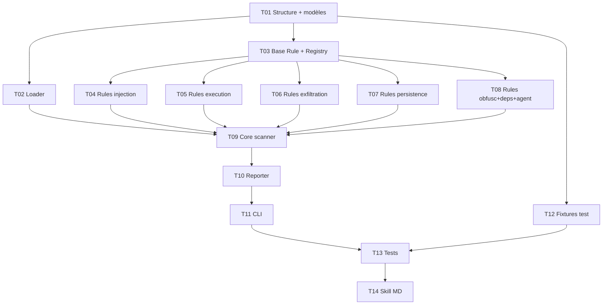

# Plan de développement — Skill Maton

**Date** : 2026-03-25
**Source** : BRAINSTORM.md

---

## 1. Vue d'ensemble

```
                         /maton <source>
                              |
                    +---------+---------+
                    |   Skill MD        |
                    |  (orchestrateur)  |
                    +---------+---------+
                              |
                   URL GitHub ? ──> git clone /tmp
                   Chemin local ? ──> copie directe
                              |
                    +---------+---------+
                    |  Scanner Python   |
                    |  (rule-based)     |
                    +---------+---------+
                              |
              +------+--------+--------+------+
              |      |        |        |      |
           injection execution exfil  persist agent
              |      |        |        |      |
              +------+--------+--------+------+
                              |
                    +---------+---------+
                    |   JSON findings   |
                    +---------+---------+
                              |
                    +---------+---------+
                    |   Skill MD        |
                    |  (formateur)      |
                    +-------------------+
                              |
                       Rapport gradué
                    CRITICAL / WARNING / INFO
```

### Arborescence projet

```
claude-skill-maton/
├── BRAINSTORM.md
├── PLAN.md
├── TASKS.md
├── scanner/
│   ├── __init__.py
│   ├── __main__.py           # CLI : python -m scanner <path>
│   ├── core.py               # Orchestrateur : charge les fichiers, applique les règles
│   ├── loader.py             # Lecture récursive des fichiers texte d'un dossier
│   ├── reporter.py           # Génération du JSON de findings
│   ├── models.py             # Dataclasses : Finding, ScanResult, Severity
│   └── rules/
│       ├── __init__.py       # Registry : collecte auto de toutes les règles
│       ├── base.py           # Classe abstraite Rule
│       ├── injection.py      # Cat 1 + 14 : prompt injection + social engineering
│       ├── execution.py      # Cat 3 + 4 : commandes + escalade privilèges
│       ├── exfiltration.py   # Cat 6 + 8 + 10 + 11 : leaks + extraction + exposition + transfert
│       ├── persistence.py    # Cat 2 + 7 + 12 : mémoire + config + persistance
│       ├── obfuscation.py    # Cat 13 : encodage, unicode tricks
│       ├── dependencies.py   # Cat 5 + 9 : MCP externes + filesystem
│       └── agent.py          # Cat 15 + 16 + 17 + 18 : permissions, outils, chaînage, hooks
├── tests/
│   ├── conftest.py           # Fixtures partagées
│   ├── fixtures/
│   │   ├── safe_skill/       # Skill légitime connue (baseline)
│   │   └── malicious_skill/  # Skill piégée (tous les vecteurs)
│   ├── test_loader.py
│   ├── test_core.py
│   ├── test_reporter.py
│   └── test_rules/
│       ├── test_injection.py
│       ├── test_execution.py
│       ├── test_exfiltration.py
│       ├── test_persistence.py
│       ├── test_obfuscation.py
│       ├── test_dependencies.py
│       └── test_agent.py
├── skill.md                  # Skill /maton pour Claude Code
└── pyproject.toml            # Config projet (pytest, ruff)
```

---

## 2. Scanner Python — Architecture

### 2.1 Modèles de données (`models.py`)

```
Severity : enum (CRITICAL, WARNING, INFO)

Finding :
  - severity   : Severity
  - category   : str           # ex: "prompt_injection"
  - rule_id    : str           # ex: "PI-001"
  - file       : str           # chemin relatif du fichier scanné
  - line       : int           # numéro de ligne
  - match      : str           # extrait du contenu matché (tronqué à 200 chars)
  - description: str           # explication humaine

ScanResult :
  - source     : str           # chemin ou URL d'origine
  - scan_date  : str           # ISO 8601
  - verdict    : str           # CRITICAL / WARNING / OK
  - summary    : dict          # {critical: N, warning: N, info: N}
  - findings   : list[Finding]
```

### 2.2 Loader (`loader.py`)

- Parcours récursif du dossier cible
- Filtre par extensions : `.md`, `.json`, `.yaml`, `.yml`, `.toml`, `.txt`, `.py`, `.sh`, `.bash`, `.zsh`
- Ignore : `.git/`, `node_modules/`, `__pycache__/`, binaires
- Retourne une liste de `(chemin_relatif, contenu_texte, lignes[])`

### 2.3 Base Rule (`rules/base.py`)

- Classe abstraite `Rule` avec :
  - `rule_id` : identifiant unique (ex: "PI-001")
  - `category` : nom de catégorie
  - `severity` : niveau par défaut
  - `description` : description humaine
  - `patterns` : liste de regex compilées
  - `scan(file_path, lines) -> list[Finding]` : applique les patterns ligne par ligne
- Méthode `scan` par défaut : itère sur les lignes, matche chaque pattern, produit un Finding par match
- Les sous-classes peuvent override `scan` pour des heuristiques plus complexes (ex: détection de combinaisons)

### 2.4 Registry (`rules/__init__.py`)

- Auto-découverte de toutes les classes Rule dans le package `rules/`
- Expose `get_all_rules() -> list[Rule]`

### 2.5 Core (`core.py`)

- `scan_directory(path: str) -> ScanResult`
- Charge les fichiers via loader
- Instancie toutes les règles via registry
- Applique chaque règle sur chaque fichier
- Calcule le verdict global (CRITICAL si >= 1 critical, WARNING si >= 1 warning, sinon OK)
- Retourne le ScanResult

### 2.6 Reporter (`reporter.py`)

- `to_json(result: ScanResult) -> str` : sérialise en JSON
- `to_stdout(result: ScanResult) -> str` : format texte lisible avec couleurs ASCII

### 2.7 CLI (`__main__.py`)

- `python -m scanner <chemin_dossier>`
- Options : `--format json|text` (défaut: json), `--output <fichier>` (défaut: stdout)
- Exit code : 2 si CRITICAL, 1 si WARNING, 0 si OK

---

## 3. Modules de règles — Regroupement

| Module | Catégories couvertes | Nb règles estimé |
|--------|---------------------|------------------|
| `injection.py` | 1 (prompt injection) + 14 (social engineering) | ~15 |
| `execution.py` | 3 (commandes) + 4 (escalade privilèges) | ~12 |
| `exfiltration.py` | 6 (leaks contexte) + 8 (extraction données) + 10 (exposition) + 11 (transfert secrets) | ~20 |
| `persistence.py` | 2 (mémoire) + 7 (config) + 12 (persistance) | ~15 |
| `obfuscation.py` | 13 (encodage, unicode) | ~8 |
| `dependencies.py` | 5 (MCP externes) + 9 (filesystem) | ~10 |
| `agent.py` | 15 (permissions) + 16 (outils) + 17 (chaînage) + 18 (hooks) | ~12 |

**Total estimé : ~92 règles**

---

## 4. Skill MD — Comportement

La skill `/maton` :

1. Reçoit l'argument (URL GitHub ou chemin local)
2. Si URL GitHub : clone dans `/tmp/maton-scan-<hash>/` via `git clone --depth 1`
3. Si chemin local : utilise directement
4. Lance `python -m scanner <chemin> --format json` via Bash
5. Lit le JSON de sortie (jamais les fichiers sources)
6. Formate un rapport lisible :
   - Verdict en gros (OK / WARNING / CRITICAL)
   - Tableau des findings groupés par sévérité
   - Pour chaque finding : fichier, ligne, rule_id, description, extrait
7. Si URL GitHub : nettoie le dossier temporaire (`trash`)

---

## 5. Phases de développement

### P0 — MVP (coeur fonctionnel)

| # | Tâche | Détail |
|---|-------|--------|
| T01 | Structure projet + modèles | pyproject.toml, models.py, arborescence |
| T02 | Loader | Lecture récursive avec filtrage extensions |
| T03 | Base Rule + Registry | Classe abstraite + auto-découverte |
| T04 | Règles injection | injection.py (~15 patterns) |
| T05 | Règles execution | execution.py (~12 patterns) |
| T06 | Règles exfiltration | exfiltration.py (~20 patterns) |
| T07 | Règles persistence | persistence.py (~15 patterns) |
| T08 | Règles obfuscation + dependencies + agent | 3 modules restants (~30 patterns) |
| T09 | Core scanner | Orchestrateur qui assemble tout |
| T10 | Reporter JSON + texte | Sérialisation + format lisible |
| T11 | CLI | __main__.py avec argparse |
| T12 | Fixtures de test | safe_skill/ + malicious_skill/ |
| T13 | Tests unitaires | Tests par module de règles + loader + core |
| T14 | Skill MD | skill.md — orchestrateur Claude Code |

### P1 — Confort (post-MVP)

- Clonage GitHub avec gestion d'erreurs (repo privé, timeout, branche spécifique)
- Rapport enrichi (stats, score de risque numérique, recommandations)
- Configuration : fichier `.matonrc` pour whitelister des règles/patterns
- Réduction faux positifs après tests sur skills réelles

### P2 — Nice-to-have

- Export HTML du rapport
- Hook CI/CD (GitHub Action)
- Mode watch (re-scan automatique sur modification)
- v2 : couche analyse sémantique sandboxée

---

## 6. Tests

### Stratégie

- **Unit tests** : chaque module de règles testé isolément avec des snippets ciblés
- **Integration tests** : scanner complet sur les fixtures safe/malicious
- **Outil** : pytest
- **Linting** : ruff

### Fixtures

- `fixtures/safe_skill/` : une skill légitime type document-skills avec MD, frontmatter, usage d'outils standard
- `fixtures/malicious_skill/` : une skill piégée contenant au moins un pattern par catégorie de détection

### Critère de validation P0

- Le scanner détecte 0 finding CRITICAL sur safe_skill
- Le scanner détecte >= 1 finding CRITICAL sur malicious_skill pour chaque catégorie

---

## 7. Ordre d'exécution



### Chemin critique

T01 → T03 → T04 → T09 → T10 → T11 → T13 → T14

---

## Checklist de lancement MVP

- [ ] `python -m scanner fixtures/safe_skill --format json` retourne verdict OK
- [ ] `python -m scanner fixtures/malicious_skill --format json` retourne verdict CRITICAL
- [ ] Chaque catégorie a au moins 1 finding sur malicious_skill
- [ ] `/maton <chemin_local>` produit un rapport lisible dans Claude Code
- [ ] `/maton <url_github>` clone, scanne et nettoie
- [ ] Zéro dépendance externe (stdlib Python uniquement)
- [ ] Tests passent avec pytest
