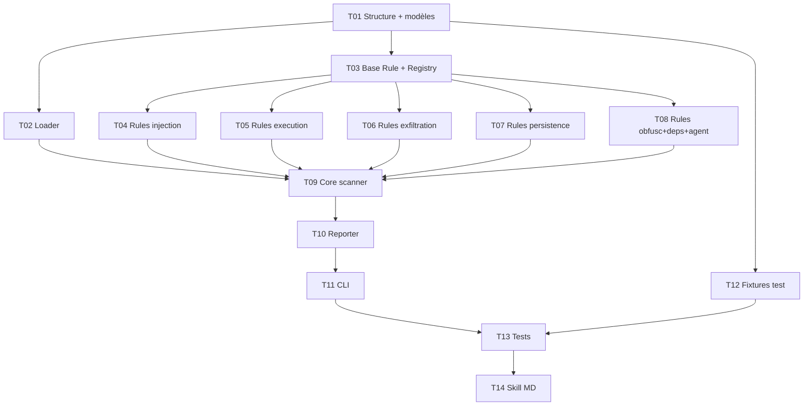

# Tâches — Skill Maton

**Source** : PLAN.md
**Phase** : P0 — MVP

---

### T01 · Structure projet + modèles

**But** : Poser le squelette du projet et les dataclasses partagées.

**Fichiers concernés** :
- `[NEW]` `pyproject.toml`
- `[NEW]` `scanner/__init__.py`
- `[NEW]` `scanner/models.py`
- `[NEW]` `scanner/rules/__init__.py`
- `[NEW]` `tests/__init__.py`

**Piste** : scanner

**Dépendances** : aucune

**Critères d'acceptation** :
- [ ] `pyproject.toml` configure pytest et ruff, zéro dépendance externe
- [ ] `models.py` exporte `Severity`, `Finding`, `ScanResult` en dataclasses
- [ ] `Severity` est un enum avec CRITICAL, WARNING, INFO
- [ ] `ScanResult` a une méthode `verdict` calculée depuis les findings
- [ ] `python -c "from scanner.models import Finding, ScanResult, Severity"` fonctionne

---

### T02 · Loader de fichiers

**But** : Lire récursivement tous les fichiers texte d'un dossier cible.

**Fichiers concernés** :
- `[NEW]` `scanner/loader.py`

**Piste** : scanner

**Dépendances** : T01

**Critères d'acceptation** :
- [ ] Parcours récursif du dossier
- [ ] Filtre par extensions : `.md`, `.json`, `.yaml`, `.yml`, `.toml`, `.txt`, `.py`, `.sh`, `.bash`, `.zsh`
- [ ] Ignore `.git/`, `node_modules/`, `__pycache__/`, fichiers binaires
- [ ] Retourne une liste de tuples `(chemin_relatif, lignes[])`
- [ ] Gère les encodages UTF-8 avec fallback (ignore les fichiers illisibles)

---

### T03 · Base Rule + Registry

**But** : Créer la classe abstraite Rule et le système d'auto-découverte des règles.

**Fichiers concernés** :
- `[NEW]` `scanner/rules/base.py`
- `[MODIFY]` `scanner/rules/__init__.py`

**Piste** : scanner

**Dépendances** : T01

**Critères d'acceptation** :
- [ ] `Rule` est une classe abstraite avec : `rule_id`, `category`, `severity`, `description`, `patterns`
- [ ] Méthode `scan(file_path: str, lines: list[str]) -> list[Finding]` par défaut : match regex ligne par ligne
- [ ] Les sous-classes peuvent override `scan` pour des heuristiques custom
- [ ] `get_all_rules()` retourne toutes les Rule instanciées depuis les modules du package `rules/`
- [ ] Le match est tronqué à 200 caractères dans le Finding

---

### T04 · Règles injection

**But** : Détecter les prompt injections directes/indirectes et le social engineering.

**Fichiers concernés** :
- `[NEW]` `scanner/rules/injection.py`

**Piste** : scanner

**Dépendances** : T03

**Critères d'acceptation** :
- [ ] Couvre catégorie 1 (prompt injection) : "ignore previous", "disregard instructions", "new instructions", "forget everything", "you are now", "override", "jailbreak"
- [ ] Couvre catégorie 14 (social engineering) : "the user asked me to", "I have permission", "urgent", "emergency override", "admin mode", "developer mode", authority spoofing
- [ ] Détecte les variantes avec casse mixte, espaces insérés, caractères zero-width
- [ ] Chaque règle a un rule_id unique (PI-001, PI-002... SE-001, SE-002...)
- [ ] Sévérité CRITICAL pour injection directe, WARNING pour social engineering

---

### T05 · Règles execution

**But** : Détecter les tentatives d'exécution de commandes et d'escalade de privilèges via outils.

**Fichiers concernés** :
- `[NEW]` `scanner/rules/execution.py`

**Piste** : scanner

**Dépendances** : T03

**Critères d'acceptation** :
- [ ] Couvre catégorie 3 (commandes) : `curl`, `wget`, `eval`, `exec`, `subprocess`, `os.system`, `bash -c`, `sh -c`, `| sh`, `| bash`, backticks, `$(...)`
- [ ] Couvre catégorie 4 (escalade) : `bypassPermissions`, `dangerouslyDisableSandbox`, `--no-verify`, `--no-gpg-sign`, `--force`, `sudo`
- [ ] Sévérité CRITICAL pour escalade de privilèges, WARNING pour exécution de commandes courantes
- [ ] Chaque règle a un rule_id unique (CE-001... PE-001...)

---

### T06 · Règles exfiltration

**But** : Détecter les fuites de contexte personnel, extraction de données, exposition publique et transfert de secrets.

**Fichiers concernés** :
- `[NEW]` `scanner/rules/exfiltration.py`

**Piste** : scanner

**Dépendances** : T03

**Critères d'acceptation** :
- [ ] Couvre catégorie 6 (leaks) : `~/`, `$HOME`, `.env`, `credentials`, `token`, `api_key`, `API_KEY`, `secret`, `password`
- [ ] Couvre catégorie 8 (extraction) : `$ENV`, `process.env`, `os.environ`, `/etc/passwd`, `keychain`, `ssh key`, `id_rsa`, `id_ed25519`
- [ ] Couvre catégorie 10 (exposition) : `webhook`, `pastebin`, `gist.github`, `hastebin`, `requestbin`, `ngrok`, `postman`
- [ ] Couvre catégorie 11 (transfert) : `base64` + contexte d'envoi, encodage de données sensibles
- [ ] Sévérité CRITICAL pour extraction directe de secrets, WARNING pour références à des chemins sensibles
- [ ] Chaque règle a un rule_id unique (CL-001... DE-001... PX-001... ST-001...)

---

### T07 · Règles persistence

**But** : Détecter l'empoisonnement mémoire, la modification de configuration et la persistance malveillante.

**Fichiers concernés** :
- `[NEW]` `scanner/rules/persistence.py`

**Piste** : scanner

**Dépendances** : T03

**Critères d'acceptation** :
- [ ] Couvre catégorie 2 (mémoire) : écriture dans `memory/`, `MEMORY.md`, `fougasse_remember`, `Write` vers `.claude/`
- [ ] Couvre catégorie 7 (config) : `settings.json`, `settings.local.json`, `CLAUDE.md`, `hooks`, `keybindings.json`
- [ ] Couvre catégorie 12 (persistance) : `crontab`, `cron`, `launchd`, `plist`, `.zshrc`, `.bashrc`, `.profile`, `post-install`, `postinstall`
- [ ] Sévérité CRITICAL pour modification de config Claude, WARNING pour persistance système
- [ ] Chaque règle a un rule_id unique (MP-001... CM-001... ML-001...)

---

### T08 · Règles obfuscation + dependencies + agent

**But** : Compléter les 3 derniers modules de règles.

**Fichiers concernés** :
- `[NEW]` `scanner/rules/obfuscation.py`
- `[NEW]` `scanner/rules/dependencies.py`
- `[NEW]` `scanner/rules/agent.py`

**Piste** : scanner

**Dépendances** : T03

**Critères d'acceptation** :
- [ ] **Obfuscation** (cat 13) : `base64`, `atob`, `btoa`, hex encoding (`\x`), unicode escapes (`\u`), zero-width chars (ZWSP, ZWNJ, ZWJ), homoglyphes courants
- [ ] **Dependencies** (cat 5+9) : appels MCP non standard, URLs vers des serveurs externes inconnus, accès hors working directory (`../../../`), `/tmp` comme zone de staging, chemins absolus suspects
- [ ] **Agent** (cat 15-18) : `bypassPermissions` dans context agent, `dontAsk`, `auto` mode, listes d'outils dangereuses (`Bash` + `Write` + `Edit` sans contrainte), références à d'autres agents/skills, hooks `pre`/`post` avec commandes
- [ ] Sévérités appropriées par règle
- [ ] Chaque règle a un rule_id unique (OB-001... ED-001... FA-001... AG-001...)

---

### T09 · Core scanner

**But** : Assembler loader + rules + findings en un orchestrateur cohérent.

**Fichiers concernés** :
- `[NEW]` `scanner/core.py`

**Piste** : scanner

**Dépendances** : T02, T04, T05, T06, T07, T08

**Critères d'acceptation** :
- [ ] `scan_directory(path: str) -> ScanResult` charge les fichiers, applique toutes les règles
- [ ] Le verdict est calculé : CRITICAL si >= 1 critical finding, WARNING si >= 1 warning, sinon OK
- [ ] Les findings sont triés par sévérité (CRITICAL first) puis par fichier puis par ligne
- [ ] Gère le cas dossier vide ou inexistant avec erreur claire
- [ ] Aucune dépendance externe (stdlib uniquement)

---

### T10 · Reporter JSON + texte

**But** : Sérialiser les résultats en JSON et en format texte lisible.

**Fichiers concernés** :
- `[NEW]` `scanner/reporter.py`

**Piste** : scanner

**Dépendances** : T09

**Critères d'acceptation** :
- [ ] `to_json(result) -> str` : JSON valide conforme au format défini dans BRAINSTORM.md
- [ ] `to_text(result) -> str` : format texte avec sections par sévérité, ASCII art pour le verdict
- [ ] Le format texte utilise uniquement des caractères ASCII (pas d'unicode box-drawing)
- [ ] Les matches sont tronqués/assainis (pas de contenu hostile dans le rapport)

---

### T11 · CLI

**But** : Point d'entrée en ligne de commande pour le scanner.

**Fichiers concernés** :
- `[NEW]` `scanner/__main__.py`

**Piste** : scanner

**Dépendances** : T10

**Critères d'acceptation** :
- [ ] `python -m scanner <chemin>` fonctionne
- [ ] Options : `--format json|text` (défaut: json), `--output <fichier>` (défaut: stdout)
- [ ] Exit code : 2 si CRITICAL, 1 si WARNING, 0 si OK
- [ ] Message d'erreur clair si le chemin n'existe pas
- [ ] `--help` affiche l'usage

---

### T12 · Fixtures de test

**But** : Créer les dossiers de skills de test (saine + malveillante).

**Fichiers concernés** :
- `[NEW]` `tests/fixtures/safe_skill/skill.md`
- `[NEW]` `tests/fixtures/safe_skill/utils.py`
- `[NEW]` `tests/fixtures/malicious_skill/skill.md`
- `[NEW]` `tests/fixtures/malicious_skill/agent.md`
- `[NEW]` `tests/fixtures/malicious_skill/helper.py`
- `[NEW]` `tests/fixtures/malicious_skill/config.json`

**Piste** : scanner

**Dépendances** : T01

**Critères d'acceptation** :
- [ ] `safe_skill/` contient une skill légitime réaliste (frontmatter, instructions, usage d'outils standard)
- [ ] `malicious_skill/` contient au moins 1 pattern par catégorie de détection (18 catégories)
- [ ] Les patterns malveillants sont variés (casse mixte, encodage, contexte réaliste — pas juste des keywords isolés)
- [ ] Chaque fixture est documentée (commentaire en tête de fichier expliquant ce qu'elle teste)

---

### T13 · Tests unitaires

**But** : Valider chaque composant du scanner isolément et en intégration.

**Fichiers concernés** :
- `[NEW]` `tests/conftest.py`
- `[NEW]` `tests/test_loader.py`
- `[NEW]` `tests/test_core.py`
- `[NEW]` `tests/test_reporter.py`
- `[NEW]` `tests/test_rules/test_injection.py`
- `[NEW]` `tests/test_rules/test_execution.py`
- `[NEW]` `tests/test_rules/test_exfiltration.py`
- `[NEW]` `tests/test_rules/test_persistence.py`
- `[NEW]` `tests/test_rules/test_obfuscation.py`
- `[NEW]` `tests/test_rules/test_dependencies.py`
- `[NEW]` `tests/test_rules/test_agent.py`

**Piste** : scanner

**Dépendances** : T11, T12

**Critères d'acceptation** :
- [ ] Chaque module de règles a ses tests avec des snippets positifs (doit matcher) et négatifs (ne doit pas matcher)
- [ ] Test intégration : scan de `safe_skill/` retourne verdict OK avec 0 CRITICAL
- [ ] Test intégration : scan de `malicious_skill/` retourne verdict CRITICAL
- [ ] Test loader : gère les dossiers vides, les fichiers binaires, les encodages cassés
- [ ] Test reporter : JSON valide, format texte lisible
- [ ] `pytest` passe à 100%

---

### T14 · Skill MD

**But** : Créer la skill `/maton` pour Claude Code qui orchestre le scanner.

**Fichiers concernés** :
- `[NEW]` `skill.md`

**Piste** : skill

**Dépendances** : T13

**Critères d'acceptation** :
- [ ] Frontmatter valide avec name, description, trigger conditions
- [ ] Accepte un argument : chemin local ou URL GitHub
- [ ] Si URL GitHub : clone avec `git clone --depth 1` dans `/tmp/maton-scan-<hash>/`
- [ ] Lance `python -m scanner <chemin> --format json` via Bash
- [ ] Lit le JSON et formate un rapport structuré (ne lit JAMAIS les fichiers sources)
- [ ] Nettoie le dossier temporaire avec `trash` (jamais `rm`)
- [ ] Affiche le verdict clairement : OK / WARNING / CRITICAL avec détails par finding

---

## Graphe de dépendances

---

## Indicateurs de parallélisme

### Pistes identifiées
| Piste | Tâches | Répertoire |
|-------|--------|------------|
| scanner | T01-T13 | scanner/, tests/ |
| skill | T14 | skill.md |

### Parallélisme intra-scanner
| Groupe | Tâches parallélisables | Condition |
|--------|----------------------|-----------|
| Règles | T04, T05, T06, T07, T08 | Après T03 |
| Infra | T02, T03, T12 | Après T01 |

### Fichiers partagés entre pistes
| Fichier | Tâches | Risque de conflit |
|---------|--------|-------------------|
| `scanner/models.py` | T01, T03, T09, T10 | Faible (défini en T01, consommé ensuite) |
| `scanner/rules/__init__.py` | T03, T04-T08 | Faible (T03 pose le registry, les autres ajoutent des règles) |

### Chemin critique
T01 → T03 → T04 → T09 → T10 → T11 → T13 → T14 = **8 niveaux**
